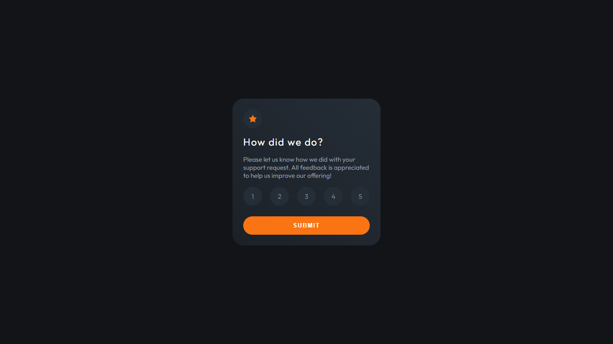

# Frontend Mentor - Interactive rating component solution

This is a solution to the [Interactive rating component challenge on Frontend Mentor](https://www.frontendmentor.io/challenges/interactive-rating-component-koxpeBUmI). Frontend Mentor challenges help you improve your coding skills by building realistic projects. 

## Table of contents

- [Overview](#overview)
  - [The challenge](#the-challenge)
  - [Screenshot](#screenshot)
  - [Links](#links)
- [My pr'ocess](#my-process)
  - [Built with](#built-with)
  - [What I learned](#what-i-learned)
  - [Continued development](#continued-development)
  - [Useful resources](#useful-resources)
- [Author](#author)
## Overview

### The challenge

Users should be able to:

- View the optimal layout for the app depending on their device's screen size
- See hover states for all interactive elements on the page
- Select and submit a number rating
- See the "Thank you" card state after submitting a rating

### Screenshot



The rater component allow users check a rating level, after submit, users will see a Thank you card with the selected rating

### Links

- Solution URL: [https://github.com/wayne-e/interactive-rating-component](https://github.com/wayne-e/interactive-rating-component)
- Live Site URL: [https://wayne-e.github.io/interactive-rating-component/](https://wayne-e.github.io/interactive-rating-component/)

## My process

### Built with

- Semantic HTML5 markup
- CSS custom properties
- Flexbox
- Mobile-first workflow
- Javascript

### What I learned


Something interesting to see:

Checked radio button
```js
const checked = document.querySelector('input[attribute="value"]:checked')
```


## Author


- Frontend Mentor - [@wayne-e](https://www.frontendmentor.io/profile/@wayne-e)
